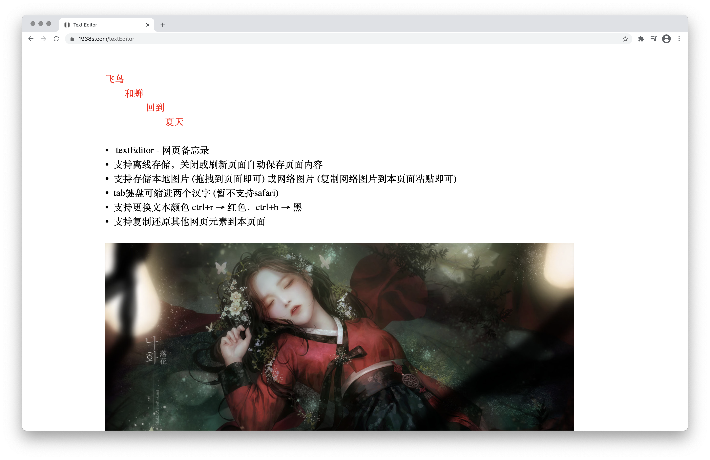

## 以下小项目均部署到 nginx 可以访问
### 音乐播放器 -> https://www.1938s.com/musicBox
### 网页备忘录 -> https://www.1938s.com/textEditor
### 原生js组件 -> https://www.1938s.com/components

#### MusicBox - 音乐播放器
• 本地音乐播放器，打开音乐文件夹添加歌曲
• 可单曲循环，列表循环，随机播放
• 可模糊搜索列表音乐
• 高亮当前播放
• 播放显示进度条
• 标签页显示当前播放歌曲名

#### TextEditor - 网页备忘录
• 支持离线存储的编辑器,刷新或者关闭页面自动保存页面内容
• 支持存储本地图片（拖拽图片到页面即可）或网络图片（右键复制网络图片到本页面粘贴即可
• tab键可缩进两个汉字 （暂不支持safari）
• 支持更换文本颜色 ctrl+r → 红色，ctrl+b → 黑色
• 支持复制还原其他网页元素到本页面

#### Components - 原生js组件
• 表单验证
• 标签切换
• 下拉搜索
• 轮播图

