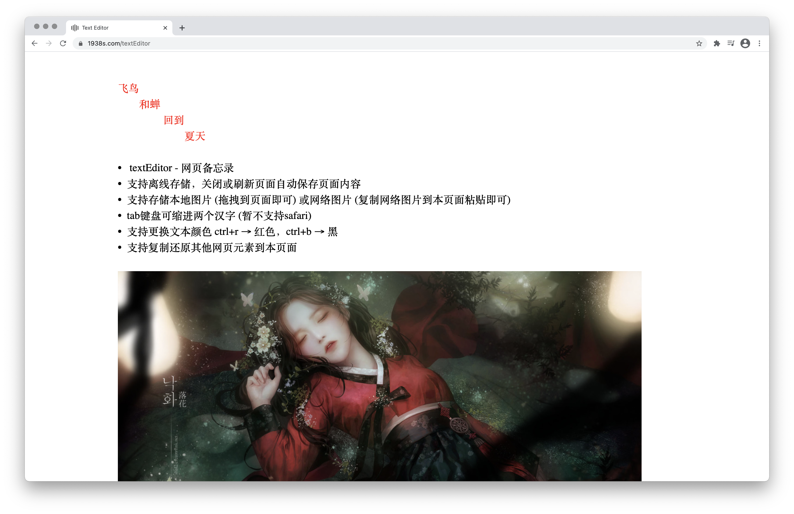

## textEditor - 网页备忘录 https://1938s.com

### 支持离线存储的编辑器,刷新或者关闭页面自动保存页面内容
### 支持存储本地图片（拖拽图片到页面即可）或网络图片（右键复制网络图片到本页面粘贴即可）
### tab键可缩进两个汉字 （暂不支持safari）
### 支持更换文本颜色 ctrl+r → 红色，ctrl+b → 黑色
### 支持复制还原其他网页元素到本页面

